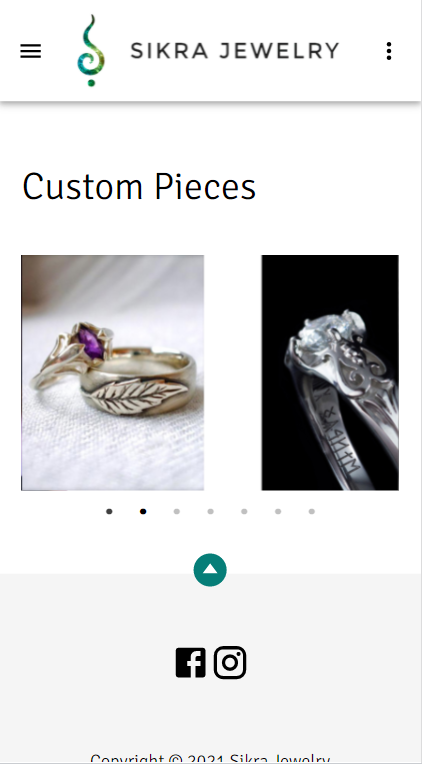

Sikra Jewelry E-commerce site

<h2>Table of Contents</h2>

- [About](https://github.com/mikloska/sikraShop/#about)
- [License](https://github.com/mikloska/sikraShop/#License) 
- [Languages & Tools](https://github.com/mikloska/sikraShop/#languages-and-tools)

<h2 href="#About">About sikrajewelry.com</h2>

Sikra Jewely is the life work of Sára Vajda, an incredibly talented goldsmith. sikrajewelry.com is her ecommerce store. Users can create accounts and login or check out as guests. All passwords are encrypted via bcrypt with salt. They also receive password recovery emails and tokens are generated when passwords are forgotten. New products are constantly added to the Nosql database for people to see and purchase.

  
  

  
  

  
  

<h2 href="#License">License</h2>

This product is licensed under the MIT License.

<h2 align="left" href="#Languages">Languages and Tools Used:</h2>

